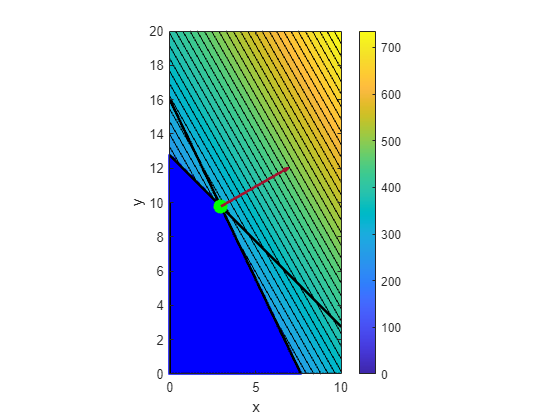
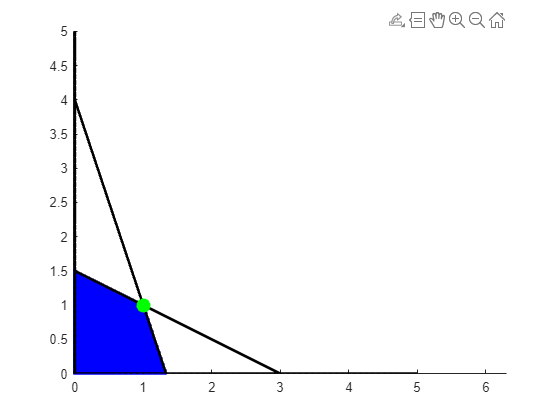

#	Problem 1

### Decision Variables

Let \( x_G \) be the production volume of Growrite (G) in liters.
Let \( x_T \) be the production volume of Tomfood (T) in liters.

### Constraints

Each type of fertilizer requires three basic ingredients (N, P, K), and there is a limited amount of these ingredients available each day.

- For Nitrogen (N), Growrite requires 0.11 kg/L and Tomfood requires 0.08 kg/L. A total of 600 kg is available.

  \[ 0.11 \cdot x_G + 0.08 \cdot x_T \leq 600 \]
  
- For Phosphorus (P), Growrite requires 0.06 kg/L and Tomfood requires 0.03 kg/L. A total of 300 kg is available.

  \[ 0.06 \cdot x_G + 0.03 \cdot x_T \leq 300 \]

- For Potassium (K), Growrite requires 0.02 kg/L and Tomfood requires 0.08 kg/L. A total of 330 kg is available.

  \[ 0.02 \cdot x_G + 0.08 \cdot x_T \leq 330 \]


Biocare aims to maximize its daily income. The selling price for Growrite is £2.80/L, and for Tomfood, it's £3.00/L.

\[ \max Z = 2.80 \cdot x_G + 3.00 \cdot x_T \]


Combining all the information, we have the following linear programming problem:

\[
\begin{array}{cc}
 \max & Z = 2.80 \cdot x_G + 3.00 \cdot x_T \\
\text { s.t. } & 0.11 \cdot x_G + 0.08 \cdot x_T \leq 600 \\
& 0.06 \cdot x_G + 0.03 \cdot x_T \leq 300 \\
& 0.02 \cdot x_G + 0.08 \cdot x_T \leq 330 \\
& x_G, x_T \geq 0 \\
\end{array}
\]
# Problem 2

After solving linear programming problem:



It can be seen from the figure that only constraint $23 x+11 y \leq 176$ and constraint $4 x+4 y \leq 51$ are active, since the direction of the gradient is toward the upper right corner of the image.

### MATLAB Code

Here is the MATLAB code to solve this problem:


```matlab
clear, close all;

% Define the coefficients for the objective function
f = [-35; -20];  % Note the negative signs for a maximization problem

% Define the inequality constraint matrix and vector
A = [23, 11; 4, 4];
b = [176; 51];

% Define the lower bound for the variables
lb = [0; 0];

% Create optimization options
options = optimoptions('linprog', 'Display', 'none');

% Solve the linear programming problem
[x, fval, exitflag, output] = linprog(f, A, b, [], [], lb, [], options);

% Convert the objective function value back to the original maximization problem
optimal_value = -fval;

% Display the results
fprintf('The optimal solution is x = %f, y = %f\n', x(1), x(2));
fprintf('The maximum value of the objective function is %f\n', optimal_value);
```

# Problem 3

1. For the first constraint \(3x - 7z \leq 176\), which is equivalent to \(3x - 7z + s_1 = 176\) where, \(s_1 \geq 0\).

2. For the second constraint \(8z - 2y + x - 6 \geq 12\), We have \(8z - 2y + x - 6 - s_2 = 12\) where, \(s_2 \geq 0\).

3. The third constraint \(4x + 3y = 19\) is already an equality constraint and needs no change.

4. Using new variables \(x_+, x_-, y_+, y_-, z_+, z_-\) to represent the positive and negative parts of \(x, y, z\), respectively. Specifically, \(x = x_+ - x_-\), \(y = y_+ - y_-\), \(z = z_+ - z_-\), where \(x_+, x_-, y_+, y_-, z_+, z_- \geq 0\).

Letting \( \mathbf{x} \) = \([x_+, x_-, y_+, y_-, z_+, z_-, s]^T\), hence

\[
\begin{array}{lll}
\text{max} & \begin{pmatrix} -30 & 30 & -21 & 21 & -18 & 18 & 0 \end{pmatrix} \begin{pmatrix} x_+ \\ x_- \\ y_+ \\ y_- \\ z_+ \\ z_- \\ s \end{pmatrix} & \\
\text{s.t.} & \begin{pmatrix}
3 & -3 & 0 & 0 & -7 & 7 & 0 \\
-1 & 1 & 2 & -2 & -8 & 8 & 0 \\
4 & -4 & 3 & -3 & 0 & 0 & -1 \\
-4 & 4 & -3 & 3 & 0 & 0 & 1
\end{pmatrix} \begin{pmatrix} x_+ \\ x_- \\ y_+ \\ y_- \\ z_+ \\ z_- \\ s \end{pmatrix} \leq \begin{pmatrix} 176 \\ -12 \\ 19 \\ -19 \end{pmatrix} & \\
& \begin{pmatrix} x_+ \\ x_- \\ y_+ \\ y_- \\ z_+ \\ z_- \\ s \end{pmatrix} \geq \begin{pmatrix} 0 \\ 0 \\ 0 \\ 0 \\ 0 \\ 0 \\ 0 \end{pmatrix} &
\end{array}
\]


# Problem 4

First, we have the primal problem:

\[
\begin{array}{cc}
\min & \left( \begin{array}{ccc} 1 & 4 & -9 \end{array} \right) z \\
\text { s.t. } & \left( \begin{array}{ccc} 1 & 0 & -1 \\ 1 & 1 & 1 \\ 4 & 3 & 0 \end{array} \right) z = \left( \begin{array}{c} 7 \\ 2 \\ 19 \end{array} \right) \\
& x, y, z \geq 0
\end{array}
\]

To obtain its dual, we introduce the Lagrange multipliers y and construct the **Lagrangian Function**:

\[ L(z,y) = \left( \begin{array}{ccc} 1 & 4 & -9 \end{array} \right) z + y^T \left( \left( \begin{array}{c} 7 \\ 2 \\ 19 \end{array} \right) - \left( \begin{array}{ccc} 1 & 0 & -1 \\ 1 & 1 & 1 \\ 4 & 3 & 0 \end{array} \right) z \right)  - s^T z
\]

Next, to obtain the **Dual Function**, we minimize the Lagrangian with respect to z:

$$
\begin{aligned}
g(y) &= \min_{z} L(z,y)  \\
&= \min_{z} z^T \left( \left( \begin{array}{c} 1 \\ 4 \\ -9 \end{array} \right) + y^T \left(\begin{array}{rrr}
1 & 1 & 4 \\
0 & 1 & 3 \\
-1 & 1 & 0
\end{array}\right) \right)  + \left( \begin{array}{c} 7 \\ 2 \\ 19 \end{array} \right)^T y 
\end{aligned}
$$

Based on the above dual function, we can form the **Dual Problem**:

$$
\begin{array}{cc}
\max & \left( \begin{array}{ccc} 7 & 2 & 19 \end{array} \right) y \\
\text { s.t. } & \left( \begin{array}{c} 1 \\ 4 \\ -9 \end{array} \right) - \left(\begin{array}{rrr}
1 & 1 & 4 \\
0 & 1 & 3 \\
-1 & 1 & 0
\end{array}\right) y = s \\
& s \geq 0,y \in \mathbb{R}^3
\end{array}
$$

# Problem 5


\[
\begin{array}{cc}
 \max & \ x_1 + x_2 \\
\text { s.t. } &  \|x\|_1^2 \leq 4 \\
\end{array}
\]

which is equivalent to:

\[
\begin{array}{cc}
 \max & \ x_1 + x_2 \\
\text { s.t. } &  \|x\|_1 \leq 2 \\
\end{array}
\]

With auxiliary variables \(z_1\) and \(z_2\), transforming the problem into:
\[
\begin{array}{cc}
 \max & \ x_1 + x_2 \\
\text { s.t. } & |x_1| \leq z_1\\
& |x_2| \leq z_2\\
& z_1 + z_2 = 2\\
\end{array}
\]

# Problem 6


$$
\begin{gathered}
\min \quad z_1+z_2+\cdots+z_n \\
\text { s.t. }-z \leq w \leq z \\
A w=y . \\
w, z \in \mathbb{R}^n
\end{gathered}
$$
To make $z_1+z_2+\cdots+z_n$ is desired to be minimal, since A have full rank which means $w$ is unique, we can let 
Let
$$
\begin{gathered}
0 \leq|w| \leq z \\
0 \leq\left|w_1\right| \leq z_1 \\
\quad \cdots \\
0 \leq\left|w_n\right| \leq z_n
\end{gathered}
$$
Therefore, when $z_1=w_1, z_2=w_2, \cdots, z_n=w_n \leftrightarrow z=|w|$ which satisfies $A w=y$
Hence, that $z^*=\left|w^*\right|$.

# Problem 7
  



The objective function is to maximize \(c^T x\), where \(c = (\cos(\alpha), \sin(\alpha))^T\). The gradient of this function is \(c\) itself. For \((1,1)\) to be an optimal solution, the gradient \(c\) should point in a direction where the function \(c^T x\) is maximized when starting from \((1,1)\).

The relevant slopes of the boundaries at the vertex \((1, 1)\) are \(-1/2\) and \(-3\). For \((1,1)\) to be an optimal solution, \(\alpha\) should fall between these two angles, i.e., \(\arctan(1/3) \leq \alpha \leq \arctan(2) \). Hence, for \(\alpha \in [0.32, 1.11]\), the point \(x = (1,1)^T\) is an optimal solution to the given linear programming problem.

# Problem 8

Original problem is:
$$\begin{array}{cc}
\max & b^T y \\
\text { s.t. } & c-A^T y=s \\
& s \geq 0, y \in \mathbb{R}^m
\end{array}$$

First we write the **Standard Form**
For the constraint $c-A^T y=s$, we have
$$
\begin{aligned}
& c-A^T y \leq s \\
& c-A^T y \geq-s
\end{aligned}
$$
And $s \geq 0$, we can rewrite as:
$$
\begin{gathered}
A^T y \leq c+s \\
-A^T y \leq s-c
\end{gathered}
$$
For the purpose of writing this in standard form, we introduce the new variable.
Let $y=y_1-y_2$
The standard form is
$$
\begin{array}{cl}
\min & b^T\left(y_1-y_2\right) \\
\text { s.t. } & A^T\left(y_1-y_2\right)=c-s \\
& y_1, y_2 \geq 0
\end{array}
$$

**Now we are proving that this problem is infeasible if and only if there is an  $x \geq 0$ such that  $Ax=0$ and  $c^T x<0$**

Since this problem is infeasible, which means the feasible set $F_d = \varnothing$.

If the feasible set $F_d \neq \varnothing$, we have 
$$
\begin{aligned}
A^T y + s &= c \\
(A^T y + s)^T x &= c^T x \\
y^T Ax + s^Tx &= c^T x \\
s^T x &= c^T x \quad \text{(Since we assume that $Ax=0$)} \\
\end{aligned}
$$

However, we know that $s \geq 0$ and $c^T x < 0$, which is a contradiction. Hence, the feasible set $F_d = \varnothing$. We prove that this problem is infeasible if there is an $x \geq 0$ such that  $Ax=0$ and  $c^T x<0$.

And we can prove by Farkas' lemma that this problem is infeasible then there is an  $x \geq 0$ such that  $Ax=0$ and  $c^T x<0$.

Hence, we have proved that this problem is infeasible if and only if there is an  $x \geq 0$ such that  $Ax=0$ and  $c^T x<0$.

# Problem 9

optimal soln is $x = (0.00, 3.00)$, $p* = 3.00$

```matlab
f = [1, 1];

A = [-2, -2; 12, 5];
b = [-5; 30];

lb = [0, 0];
ub = [inf, inf];

opts = optimoptions('linprog','Display','none');

intcon = [1, 2];
[x,fval]= linprog(f,A,b,[],[],lb, ub, opts);
fprintf("optimal soln is x = (%1.2f, %1.2f), p* = %1.2f\n", [x; fval]) 

%% impose x(2) <= 2
[x,fval] = linprog(f,A,b,[],[],lb, [inf, 2], opts);
fprintf("optimal soln with y(2)<=2 is x = (%1.2f, %1.2f), p* = %1.2f\n", [x; fval]) 

%% impose x(2) >= 3
[x,fval] = linprog(f,A,b,[],[],[0, 3],ub, opts);
fprintf("optimal soln with y(2)>=3 is x = (%1.2f, %1.2f), p* = %1.2f\n", [x; fval]) 

%% using intlinprog
opts = optimoptions('intlinprog', 'Display', 'none');
[x, fval] = intlinprog(f, intcon, A, b, [], [], lb, ub, opts);

fprintf("optimal soln is x = (%1.2f, %1.2f), p* = %1.2f\n", [x; fval]) 
```